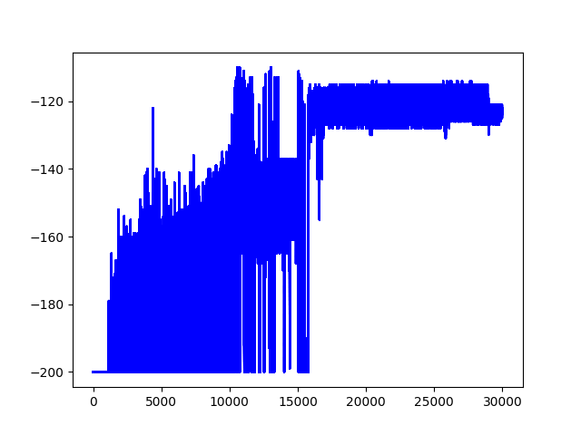
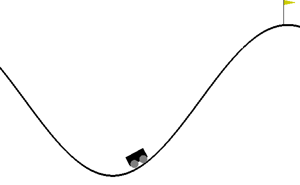

# Inverse RL

## Introduction

This repository contains PyTorch implementations of **Inverse Reinforcement Learning (IRL)** algorithms.

- Maximum Entropy Inverse Reinforcement Learning 
- Inverse Reinforcement Learning through Policy Gradient Minimization

We have implemented and trained the agents with the IRL algorithms using the following environments.

- [OpenAI GYM Mountain car](https://gym.openai.com/envs/MountainCar-v0/)

## Mountain car

We have implemented Maximum Entropy IRL  in `MountainCar-v0` environment.

### 1. Information

- [Mountain car Wiki](https://github.com/openai/gym/wiki/MountainCar-v0)

### 2. Expert's demonstrations

Navigate to `expert_demo.npy` in [cd /policy-gradient-minimization-irl/MountainCar-V0/src/expert_demo](https://github.com/gulshan-mittal/policy-gradient-minimization-irl/tree/master/MountainCar-V0/src/expert_demo) 

### 3. Train & Test

Navigate to [src folder](https://github.com/gulshan-mittal/policy-gradient-minimization-irl/tree/master/MountainCar-V0/src) folder.

**Train** the agent wtih `Maximum Entropy IRL algorithm` without rendering.

~~~
python train.py
~~~

If you want to test `Maximum Entropy IRL algorithm`, **Test** the agent with the saved model `maxent_q_table.npy` in `src/results` folder.

~~~
python test.py
~~~

### 4. Trained Agent

We have trained the agents using `MountainCar-v0` environment.

| Algorithms | Scores Vs Episodes | GIF |
|:---:|:---:|:---:|
| MaxEnt |  |  |

## Implementation team members

* Gulshan Kumar : [Github](https://github.com/gulshan-mittal)
* Nirvan Singhania : [Github](https://github.com/NirvanSinghania)
* Aman Bansal : [Github](https://github.com/Axle7XStriker)